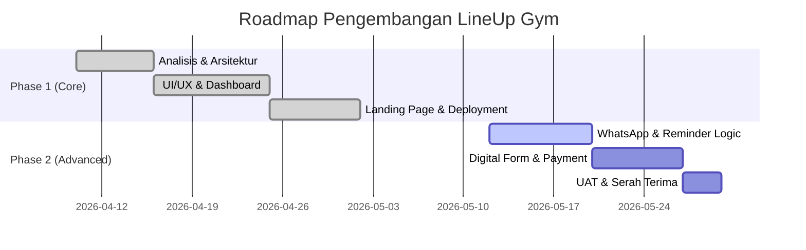

# 📅 Project Roadmap & Mandays Breakdown: LineUp Gym

Dokumen ini memberikan transparansi mengenai rincian teknis, alokasi waktu, dan jadwal pengembangan sistem LineUp Gym.

---

## 📊 1. Detail Breakdown & Alokasi Mandays

| No | Task / Modul | Mandays | Status | Deskripsi Pekerjaan |
| :--- | :--- | :---: | :---: | :--- |
| **A** | **PHASE 1: Core System & Foundation** | **22** | **Done** | |
| 1 | Requirement Gathering & Site Observation | 2 | ✅ | Observasi flow member di lokasi & wawancara admin. |
| 2 | System Architecture & Database Design | 4 | ✅ | Perancangan Schema DB & Security (RLS) di Supabase. |
| 3 | UI/UX Development (Dark Neon Theme) | 5 | ✅ | Pembuatan layout dashboard & komponen interface. |
| 4 | Member Management Module | 4 | ✅ | Fitur CRUD member, filter status, & auto-numbering. |
| 5 | Financial Dashboard & Analytics | 4 | ✅ | Grafik pendapatan, sebaran paket, & rekapitulasi. |
| 6 | Landing Page & Asset Integration | 3 | ✅ | Web publik untuk branding & galeri fasilitas. |
| **B** | **PHASE 2: Automation & Advanced CRM** | **18** | **To-Do** | |
| 7 | WhatsApp Gateway Integration | 4 | ⏳ | Integrasi API Fonnte untuk notifikasi sistem. |
| 8 | Auto-Reminder Logic (H-7, H-3, H-Day) | 4 | ⏳ | Background job untuk cek member expired otomatis. |
| 9 | Digital Registration Form (Online) | 3 | ⏳ | Link pendaftaran mandiri untuk calon member baru. |
| 10 | Payment Gateway Integration (QRIS) | 4 | ⏳ | Integrasi Midtrans/Xendit untuk pembayaran otomatis. |
| 11 | UAT, Training Admin, & Final Deployment | 3 | ⏳ | Uji coba menyeluruh & serah terima sistem ke owner. |
| | **TOTAL MANDAYS** | **40** | | **Estimasi ~2 Bulan Kalender** |

---

## 🗓️ 2. Visual Timeline (Gantt Chart)

---

## 💡 3. Penjelasan Teknis untuk Owner

1.  **Apa itu Mandays?**
    *Mandays* adalah satuan hari kerja efektif (8 jam/hari). Total **40 Mandays** berarti sistem ini dibangun dengan total durasi pengerjaan setara dengan 320 jam kerja profesional.
    
2.  **Kenapa Fase 2 Sangat Penting?**
    Fase 2 adalah bagian "pintar" dari CRM ini. Di sinilah sistem mulai bekerja sendiri untuk menagih member (WhatsApp) dan menerima uang (QRIS) tanpa perlu campur tangan admin secara manual.

3.  **Masa Garansi & Support**
    Setelah Fase 2 selesai (Handover), owner mendapatkan masa garansi selama **3 bulan** untuk perbaikan bug atau error tanpa biaya tambahan.

---

---

## 📋 4. Project Requirements Summary (Requirement Breakdown)

*Bagian ini dapat disalin untuk keperluan pembuatan dokumentasi teknis atau briefing AI (Claude/GPT).*

**Project Name:** LineUp Gym Management System (Vertical CRM)  
**Tech Stack:** Next.js, Supabase, Tailwind CSS, TanStack Query.

### Core Features (Phase 1):
*   **Smart Member Management:** Database member real-time dengan status otomatis (Active/Expired).
*   **Financial Analytics:** Dashboard pendapatan per periode dan distribusi paket.
*   **Digital Asset Mgmt:** Galeri fasilitas dinamis untuk landing page.
*   **Security:** Row Level Security (RLS) untuk proteksi data member.

### Advanced Features (Phase 2):
*   **WhatsApp CRM Gateway:** Integrasi notifikasi & struk digital via Fonnte.
*   **Auto-Retention:** Reminder otomatis H-7, H-3, & H-Day via WhatsApp.
*   **Online Registration Form:** Form pendaftaran mandiri untuk calon member.
*   **Payment Automation:** Integrasi QRIS (Midtrans/Xendit) untuk verifikasi pembayaran otomatis.

### Design Tone:
*   **Style:** Modern Dark Mode / Cyberpunk (Black & Neon Red).
*   **Target:** High Efficiency for Admin & High Conversion for Landing Page.
